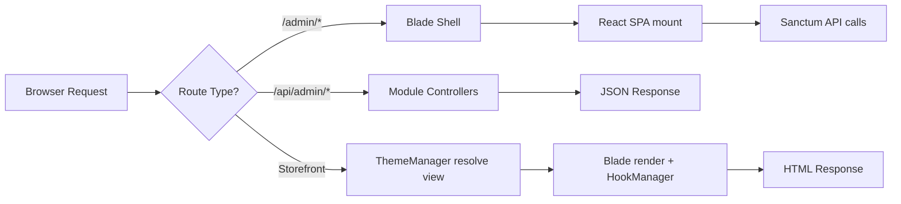

<p align="center">
  <strong>⬡ CMBCORE Commerce</strong>
</p>

<p align="center">
  Nền tảng thương mại điện tử modular, mã nguồn mở — xây dựng trên <strong>Laravel 10</strong> &amp; <strong>React 18</strong>.<br>
  Kiến trúc plugin/theme/module tách biệt hoàn toàn, mở rộng không giới hạn.
</p>

<p align="center">
  <a href="#quick-start">Quick Start</a> ·
  <a href="#kiến-trúc-tổng-quan">Kiến trúc</a> ·
  <a href="#tạo-plugin-mới">Plugin Guide</a> ·
  <a href="#tạo-theme-mới">Theme Guide</a> ·
  <a href="#contributing">Contributing</a>
</p>

---

> **⚠️ Trạng thái:** Đang trong giai đoạn phát triển tích cực bởi **CMB Core Team**.  
> API surface có thể thay đổi giữa các phiên bản minor cho đến khi release `v1.0 stable`.

---

## Tính năng chính

| Khả năng | Mô tả |
|-----------|--------|
| **27 Modules** | Category · Product · Order · Blog · Page · Cart · Coupon · Customer · Shipping · Payment · Tax · Inventory · Review · Wishlist · FlashSale · Banner · MediaLibrary · Reports · Returns · Search · Notifications · ImportExport · ActivityLog · SeoTools · System · ThemeManager · PluginManager |
| **5 Plugins** | StorefrontNotice · ContactForm · ImageOptimizer · PaymentCod · SeoTools |
| **Theme Engine** | Blade-based, kế thừa parent, cài ZIP từ admin, live preview |
| **Plugin System** | Hook-driven, cài ZIP, settings runtime, admin pages riêng, database migration tự động |
| **Admin SPA** | React 18 + Ant Design 5 + Vite HMR, đa ngôn ngữ (vi/en) |
| **Page Builder** | Puck Editor kéo-thả block cho trang tĩnh, plugin đăng ký block riêng |
| **Storefront** | Server-rendered Blade, SEO-first, responsive mobile toolbar |
| **Đa ngôn ngữ** | Hệ thống `LocalizationManager` với file PHP, hỗ trợ vi/en |

## Tech Stack

```
Backend       Laravel 10 · PHP 8.2+ · SQLite / MySQL
Admin SPA     React 18 · React Router 6 · Ant Design 5 · Vite 5
Storefront    Blade · Font Awesome 7 · SCSS
Page Builder  Puck Editor 0.21
Auth          Laravel Sanctum (SPA cookie-based)
```

---

## Quick Start

```bash
# 1. Clone & cài đặt
git clone https://github.com/cmbcore/commerce.git
cd commerce
composer install
npm install

# 2. Cấu hình
cp .env.example .env
php artisan key:generate

# 3. Database & seed
php artisan migrate
php artisan db:seed
php artisan storage:link

# 4. Chạy dev server
php artisan serve     # → http://localhost:8000
npm run dev           # Vite HMR
```

**Tài khoản admin mặc định:** `admin@weblong.test` / `password`

---

## Kiến trúc tổng quan

```
cmbcore/
├── app/
│   ├── Core/
│   │   ├── Module/          # ModuleManager — auto-discover & boot modules
│   │   ├── Plugin/          # PluginManager · HookManager · ScopedHookManager
│   │   ├── Theme/           # ThemeManager — resolve views, settings, menus
│   │   └── Localization/    # LocalizationManager — vi/en runtime switch
│   ├── Models/              # Eloquent models dùng chung (User, InstalledPlugin…)
│   └── Services/            # Shared services (PackageZipInstaller…)
├── modules/                 # ← 27 business modules (tự đăng ký routes, migrations)
├── plugins/                 # ← Plugin mở rộng (cài thêm qua ZIP)
├── themes/                  # ← Theme storefront (Blade views + assets)
├── resources/
│   ├── js/admin/            # React SPA admin
│   └── scss/                # SCSS dùng chung
├── lang/                    # vi/ · en/ — admin & storefront translations
├── config/                  # modules.php · plugins.php · themes.php
└── public/
    └── theme-assets/        # Static assets của theme (symlink)
```

### Luồng request



### Module ↔ Plugin ↔ Theme

```
┌─────────────────────────────────────────────────────┐
│                    CMBCORE Core                     │
│  ModuleManager · PluginManager · ThemeManager       │
│                    HookManager                      │
├──────────┬──────────────┬───────────────────────────┤
│ Modules  │   Plugins    │         Themes            │
│ ──────── │ ──────────── │ ─────────────────         │
│ Product  │ ContactForm  │ default (parent)          │
│ Order    │ ImageOptim.  │ cmbcore (child)           │
│ Blog     │ StorefrontN. │ cmbcore-electro (child)   │
│ Page     │ PaymentCod   │                           │
│ Cart     │ SeoTools     │                           │
│ ...27    │              │                           │
└──────────┴──────────────┴───────────────────────────┘
```

**Modules** là business logic cốt lõi (Product, Order, Blog…). Chúng đăng ký routes, migrations, admin pages tự động thông qua `module.json`.

**Plugins** là phần mở rộng cài/gỡ runtime — giao tiếp với core và modules qua **Hook System** (actions + filters). Plugin có thể đăng ký admin pages, database migrations, Puck blocks, và storefront hooks.

**Themes** là lớp presentation — chứa Blade views, assets, settings schema và menu definitions. Theme hỗ trợ kế thừa parent (child theme).

---

## Hook System

Hook là cơ chế trung tâm cho phép plugin can thiệp vào mọi nơi mà không sửa code core.

### Actions — fire & forget

```php
// Đăng ký listener (trong plugin boot())
$hooks->register('product.created', function (Product $product): void {
    Log::info('New product!', ['id' => $product->id]);
}, priority: 10);

// Core fire hook
$this->hookManager->fire('product.created', $product);
```

### Filters — transform data

```php
// Plugin thêm Puck block definition
$hooks->filter('page.block_definitions', function (array $blocks): array {
    $blocks[] = [
        'type'   => 'ContactForm',
        'label'  => 'Form Liên Hệ',
        'fields' => [...],
    ];
    return $blocks;
});

// Core apply filter
$blocks = $this->hookManager->applyFilter('page.block_definitions', $defaultBlocks);
```

### Render — inject HTML

```php
// Plugin đăng ký render hook
$hooks->register('theme.head', fn () => '<style>...</style>');
$hooks->register('theme.footer', fn () => '<section>...</section>');

// Theme Blade gọi render
{!! app(\App\Core\Plugin\HookManager::class)->render('theme.head') !!}
```

### Các hook có sẵn

| Hook | Loại | Mô tả |
|------|------|--------|
| `theme.head` | Action/Render | Inject vào `<head>` storefront |
| `theme.footer` | Action/Render | Inject trước `</body>` storefront |
| `product.created` | Action | Sau khi tạo product |
| `page.block_definitions` | Filter | Thêm Puck block definitions |
| `admin.dashboard.widgets` | Filter | Thêm widget vào dashboard admin |

> **Convention:** Hook names dùng format `{scope}.{event}` — viết thường, phân cách bằng dấu chấm.

---

## Tạo Plugin mới

### 1. Cấu trúc thư mục

```
plugins/
└── MyPlugin/
    ├── plugin.json                          # ← Manifest (bắt buộc)
    ├── src/
    │   ├── MyPluginPlugin.php               # ← Main class implements PluginInterface
    │   ├── Http/Controllers/
    │   │   └── MyPluginController.php
    │   ├── Models/
    │   │   └── MyModel.php
    │   └── routes_api.php                   # API routes
    ├── database/
    │   └── migrations/
    │       └── 2026_01_01_create_xxx.php    # Laravel migrations
    ├── resources/
    │   ├── js/pages/
    │   │   └── MyPluginDashboard.jsx        # React admin page
    │   └── views/
    │       └── block.blade.php              # Puck block storefront view
    └── README.md
```

### 2. Plugin Manifest — `plugin.json`

```json
{
  "name": "My Plugin",
  "alias": "my-plugin",
  "version": "1.0.0",
  "description": "Mô tả chức năng plugin.",
  "author": "Your Name",
  "requires": {
    "core": ">=1.0.0",
    "modules": ["product"]
  },
  "settings": [
    {
      "group": "general",
      "label": "Cài đặt chung",
      "fields": [
        {
          "key": "api_key",
          "label": "API Key",
          "type": "text",
          "default": ""
        },
        {
          "key": "enabled",
          "label": "Kích hoạt",
          "type": "boolean",
          "default": true
        }
      ]
    }
  ],
  "hooks": {
    "listens": ["theme.footer", "product.created"]
  },
  "admin": {
    "menu": [
      {
        "translation_key": "admin.plugins.my_plugin.menu",
        "icon": "fa-solid fa-puzzle-piece",
        "route": "/admin/plugins/my-plugin"
      }
    ],
    "pages": {
      "/admin/plugins/my-plugin": "plugins/MyPlugin/resources/js/pages/MyPluginDashboard.jsx"
    }
  }
}
```

**Các field types hỗ trợ trong `settings`:** `text` · `textarea` · `number` · `boolean` · `select` · `color` · `image`

### 3. Main Class — implement `PluginInterface`

```php
<?php

declare(strict_types=1);

namespace Plugins\MyPlugin;

use App\Core\Plugin\Contracts\PluginInterface;
use App\Core\Plugin\HookManager;
use Illuminate\Support\Facades\Route;

class MyPluginPlugin implements PluginInterface
{
    public function boot(HookManager $hooks): void
    {
        // Đăng ký Blade views
        view()->addNamespace('my-plugin', __DIR__ . '/../resources/views');

        // Đăng ký API routes
        Route::prefix('api/admin/my-plugin')
            ->middleware(['api', 'auth:sanctum'])
            ->group(__DIR__ . '/routes_api.php');

        // Đăng ký hooks
        $hooks->register('theme.footer', function (): string {
            return view('my-plugin::widget')->render();
        });
    }

    public function activate(): void
    {
        // Chạy khi bật plugin lần đầu (migrations tự động chạy bởi core)
    }

    public function deactivate(): void
    {
        // Cleanup khi tắt plugin
    }

    public function uninstall(): void
    {
        // Xóa data khi gỡ plugin
    }
}
```

### 4. Database Migrations

Đặt migrations vào `database/migrations/`. Core tự động chạy khi plugin được kích hoạt.

```php
// database/migrations/2026_01_01_000000_create_my_table.php

use Illuminate\Database\Migrations\Migration;
use Illuminate\Database\Schema\Blueprint;
use Illuminate\Support\Facades\Schema;

return new class extends Migration {
    public function up(): void
    {
        Schema::create('my_plugin_records', function (Blueprint $table) {
            $table->id();
            $table->string('name');
            $table->json('data')->nullable();
            $table->boolean('is_active')->default(true);
            $table->timestamps();
        });
    }

    public function down(): void
    {
        Schema::dropIfExists('my_plugin_records');
    }
};
```

### 5. React Admin Page

```jsx
// resources/js/pages/MyPluginDashboard.jsx
import React, { useEffect, useState } from 'react';
import { Card, Typography, Table, Button, message } from 'antd';
import axios from 'axios';
import { useLocale } from '@admin/hooks/useLocale';

const { Title, Paragraph } = Typography;

export default function MyPluginDashboard() {
    const { t } = useLocale();
    const [data, setData] = useState([]);
    const [loading, setLoading] = useState(true);

    useEffect(() => {
        axios.get('/api/admin/my-plugin/list')
            .then(res => setData(res.data.data))
            .catch(() => message.error('Không tải được dữ liệu.'))
            .finally(() => setLoading(false));
    }, []);

    return (
        <>
            <div className="page-header">
                <div>
                    <Title level={3} className="page-header__title">
                        My Plugin
                    </Title>
                    <Paragraph className="page-header__description">
                        Mô tả ngắn về plugin.
                    </Paragraph>
                </div>
            </div>
            <Card>
                <Table dataSource={data} loading={loading} rowKey="id" columns={[
                    { title: 'Tên', dataIndex: 'name' },
                    { title: 'Trạng thái', dataIndex: 'is_active' },
                ]} />
            </Card>
        </>
    );
}
```

### 6. Đăng ký Puck Block (tùy chọn)

Plugin đăng ký block cho Page Builder qua filter hook:

```php
$hooks->filter('page.block_definitions', function (array $blocks): array {
    $blocks[] = [
        'type'   => 'MyWidget',
        'label'  => 'My Widget',
        'fields' => [
            'title' => ['type' => 'text', 'label' => 'Tiêu đề'],
            'color' => ['type' => 'text', 'label' => 'Màu nền'],
        ],
        'defaultProps' => [
            'title' => 'Hello World',
            'color' => '#ffffff',
        ],
        'render' => 'my-plugin::blocks.widget',
    ];
    return $blocks;
});
```

### 7. Phân phối

Plugin có thể đóng gói thành file **ZIP** và cài trực tiếp từ admin:

```
Admin → Plugin → Cài ZIP → Upload → Tự động giải nén, migrate, kích hoạt
```

Core tự động phát hiện `plugin.json`, resolve main class từ thư mục `src/`, chạy migrations nếu có.

---

## Tạo Theme mới

### 1. Cấu trúc thư mục

```
themes/
└── my-theme/
    ├── theme.json              # ← Manifest (bắt buộc)
    ├── views/
    │   ├── layouts/
    │   │   ├── app.blade.php   # Layout chính
    │   │   ├── header.blade.php
    │   │   └── footer.blade.php
    │   ├── home.blade.php      # Trang chủ
    │   ├── products/
    │   │   ├── index.blade.php
    │   │   └── show.blade.php
    │   ├── blog/
    │   ├── pages/
    │   ├── cart/
    │   ├── checkout/
    │   ├── account/
    │   ├── orders/
    │   ├── search/
    │   └── partials/
    │       └── product-card.blade.php
    ├── assets/                 # CSS, JS, images
    │   ├── css/
    │   ├── js/
    │   └── images/
    └── config/                 # File cấu hình bổ sung (tùy chọn)
```

### 2. Theme Manifest — `theme.json`

```json
{
  "name": "My Theme",
  "alias": "my-theme",
  "version": "1.0.0",
  "description": "Theme storefront hiện đại, tối giản.",
  "author": "Your Name",
  "parent": "default",
  "supports": ["products", "blog", "pages"],
  "settings": [
    {
      "group": "colors",
      "label": "Bảng màu",
      "description": "Màu chủ đạo cho giao diện.",
      "fields": [
        {
          "key": "primary_color",
          "label": "Màu chính",
          "type": "color",
          "default": "#4f46e5",
          "span": 8
        }
      ]
    },
    {
      "group": "branding",
      "label": "Thương hiệu",
      "fields": [
        {
          "key": "logo_image",
          "label": "Logo",
          "type": "image",
          "default": "/theme-assets/my-theme/images/logo.png",
          "span": 8
        },
        {
          "key": "footer_contact",
          "label": "Thông tin liên hệ",
          "type": "object",
          "fields": [
            { "key": "company", "label": "Tên công ty", "type": "text", "default": "" },
            { "key": "phone",   "label": "Điện thoại",  "type": "text", "default": "" },
            { "key": "email",   "label": "Email",       "type": "text", "default": "" }
          ]
        }
      ]
    }
  ],
  "templates": {
    "page": [
      { "name": "default", "label": "Mặc định" },
      { "name": "landing", "label": "Landing Page" }
    ]
  },
  "menus": [
    {
      "alias": "main_menu",
      "label": "Menu chính",
      "description": "Menu header storefront.",
      "items": [
        { "label": "Trang chủ", "url": "/", "icon": null, "target": "_self" },
        { "label": "Sản phẩm", "url": "/san-pham", "icon": null, "target": "_self" }
      ]
    }
  ]
}
```

### Setting field types

| Type | Mô tả | Props bổ sung |
|------|--------|---------------|
| `text` | Input text đơn dòng | `span` |
| `textarea` | Input nhiều dòng | `rows`, `span` |
| `number` | Input số | `min`, `max`, `span` |
| `color` | Color picker | `span` |
| `boolean` | Toggle on/off | `span` |
| `select` | Dropdown lựa chọn | `options: [{value, label}]`, `span` |
| `image` | Upload ảnh với crop | `span` |
| `object` | Nhóm fields con | `fields: [...]` |
| `repeater` | Danh sách thêm/xóa/sắp xếp | `fields: [...]`, `default: [...]` |

### 3. Layout chính — `app.blade.php`

```blade
<!DOCTYPE html>
<html lang="{{ app()->getLocale() }}">
<head>
    <meta charset="UTF-8">
    <meta name="viewport" content="width=device-width, initial-scale=1.0">
    <title>@yield('title', $settings['site_title'] ?? 'Store')</title>

    {{-- Theme assets --}}
    <link rel="stylesheet" href="{{ asset('theme-assets/' . $activeTheme . '/css/style.css') }}">

    {{-- Plugin head hooks --}}
    {!! app(\App\Core\Plugin\HookManager::class)->render('theme.head') !!}
</head>
<body>
    @include('header')

    <main>
        @yield('content')
    </main>

    @include('footer')

    {{-- Plugin footer hooks --}}
    {!! app(\App\Core\Plugin\HookManager::class)->render('theme.footer') !!}
</body>
</html>
```

### 4. Truy cập settings trong Blade

Tất cả settings từ `theme.json` có thể truy cập qua biến `$settings`:

```blade
{{-- Màu chính --}}
<style>
    :root { --primary: {{ $settings['primary_color'] ?? '#4f46e5' }}; }
</style>

{{-- Logo --}}


{{-- Menu --}}
@foreach ($menus['main_menu'] ?? [] as $item)
    <a href="{{ $item['url'] }}" target="{{ $item['target'] ?? '_self' }}">
        {{ $item['label'] }}
    </a>
@endforeach
```

### 5. Kế thừa Parent Theme

Khai báo `"parent": "default"` trong `theme.json`. View resolution:

1. Tìm trong `themes/my-theme/views/`
2. Fallback về `themes/default/views/`

Chỉ cần override các view cần thay đổi — không cần copy toàn bộ parent.

### 6. Phân phối Theme

Đóng gói toàn bộ thư mục theme thành file ZIP:

```
Admin → Giao diện → Cài ZIP → Upload → Tự động nhận diện, kích hoạt
```

Core tự phát hiện trùng lặp (theo `alias` + `version`), cho phép ghi đè hoặc hủy.

---

## Quy chuẩn code

### PHP (Backend)

- `declare(strict_types=1)` trong mọi file PHP
- Namespace theo cấu trúc thư mục: `Plugins\{Name}\...`, `Modules\{Name}\...`
- Response API luôn trả JSON: `{ data: ... }` hoặc `{ message: "..." }`
- Validation dùng Form Request hoặc inline `$request->validate([...])`
- Model dùng `$casts` cho JSON columns, tránh raw SQL functions không portable (ví dụ: `JSON_LENGTH` chỉ có trên MySQL, dùng PHP `count()` thay thế)

### JavaScript (Admin SPA)

- Component React viết dạng **function component** + hooks
- Localization dùng `useLocale()` → `t('key.path')`, **không hardcode text**
- API calls dùng `axios` với base path `/api/admin/`
- Plugin admin pages export `default function` component, lazy-loaded bởi core SPA
- CSS classes theo BEM: `.plugin-name__element--modifier`

### Theme (Blade)

- Blade views sử dụng `@extends`, `@section`, `@yield`, `@include`
- **Không hardcode text** — dùng `$settings` từ `theme.json` hoặc translation helpers
- Assets đặt trong thư mục `assets/`, served qua `/theme-assets/{alias}/`
- Responsive-first: mobile toolbar, fluid grids, breakpoint-aware layouts

### Naming Conventions

| Đối tượng | Convention | Ví dụ |
|-----------|-----------|-------|
| Module dir | PascalCase | `modules/Product/` |
| Plugin dir | PascalCase | `plugins/ContactForm/` |
| Theme dir | kebab-case | `themes/cmbcore-electro/` |
| Plugin alias | kebab-case | `contact-form` |
| Hook name | dot.notation | `product.created` |
| Translation key | dot.notation | `admin.plugins.contact_form.menu` |
| CSS class | BEM kebab-case | `.contact-form__field--required` |
| API route | kebab-case | `/api/admin/contact-forms/list` |
| DB table | snake_case | `contact_submissions` |

---

## Kiểm tra chất lượng

```bash
# PHP tests
php artisan test

# PHP code style (Laravel Pint)
./vendor/bin/pint

# JS lint
npm run lint

# Production build (verify no errors)
npm run build
```

ESLint quét:
- `resources/js/admin/`
- `modules/**/Resources/js/`
- `plugins/**/resources/js/`

---

## Cấu trúc Route Storefront

| Route | Mô tả |
|-------|--------|
| `/` | Homepage |
| `/san-pham` | Product listing |
| `/san-pham/{slug}` | Product detail |
| `/danh-muc-san-pham/{slug}` | Product category |
| `/bai-viet` | Blog listing |
| `/category/{slug}` | Blog category |
| `/{post-slug}` | Blog post (fallback resolver) |
| `/{page-slug}` | Static page (fallback resolver) |
| `/gio-hang` | Cart |
| `/thanh-toan` | Checkout |
| `/tai-khoan` | Customer account |
| `/tim-kiem` | Search |

---

## Biến môi trường

| Key | Mô tả | Default |
|-----|--------|---------|
| `DEFAULT_THEME` | Theme storefront mặc định | `cmbcore` |
| `MODULES_PATH` | Đường dẫn scan modules | `modules` |
| `PLUGINS_PATH` | Đường dẫn scan plugins | `plugins` |
| `APP_CORE_VERSION` | Phiên bản core (để check `requires`) | `1.0.0` |

---

## Roadmap

- [x] Core engine: Module · Plugin · Theme · Hook · Localization
- [x] Admin SPA với React + Ant Design
- [x] 27 Modules storefront hoàn chỉnh
- [x] Plugin system với ZIP install, settings runtime, admin pages
- [x] Theme engine với child theme, structured settings, menu editor
- [x] Page Builder (Puck) với plugin block registration
- [ ] REST API public cho headless storefront
- [ ] Plugin marketplace
- [ ] Multi-vendor support
- [ ] Automated testing CI/CD pipeline
- [ ] Documentation site

---

## Contributing

Chúng tôi hoan nghênh đóng góp từ cộng đồng! Vui lòng:

1. Fork repository
2. Tạo branch: `git checkout -b feature/my-feature`
3. Commit changes: `git commit -m 'feat: add my feature'`
4. Push: `git push origin feature/my-feature`
5. Tạo Pull Request

**Commit convention:** Dùng [Conventional Commits](https://www.conventionalcommits.org/) — `feat:`, `fix:`, `docs:`, `refactor:`, `chore:`.

---

## License

Dự án đang trong giai đoạn phát triển nội bộ bởi **CMB Core Team**. License sẽ được công bố khi release phiên bản stable.

---

<p align="center">
  Built with ❤️ by <strong>CMB Core Team</strong><br>
  <a href="https://cmbcore.com">cmbcore.com</a> · 0966.281.850
</p>
